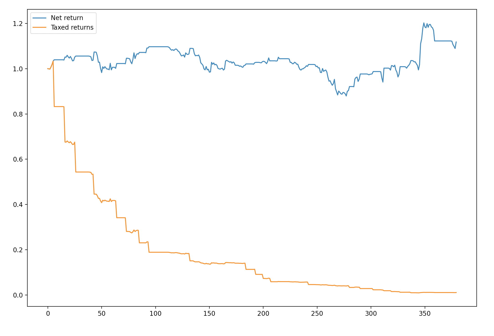
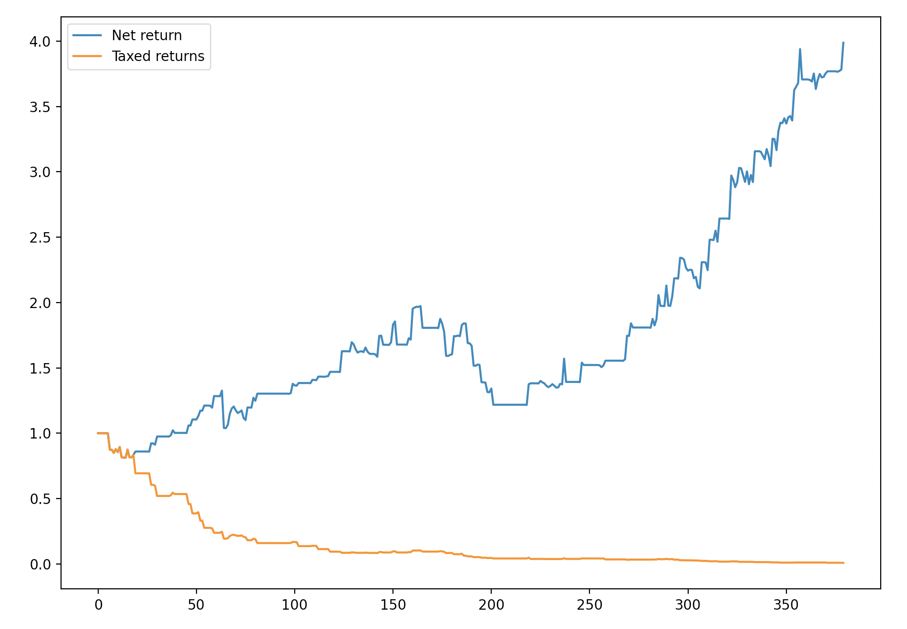

# Pairs Trading

A lightweight pairs trading bot. Made to quickly and accurately backtest strategies. 

---

## Cointegration

Two time series can be tested for [cointegration](https://en.wikipedia.org/wiki/Cointegration) using the Engle-Granger or similar tests. If $x_t$ and $y_t$ are cointegrated, then a linear combination of them is stationary for some $\beta$ and $u_t$. In other words,

$$y_t - \beta x_t = u_t $$

where $u_t$ is stationary.

---

## Trading Bot

The Trader class models the logarithmic prices of two assets as such:

$$\log(y_t) = \alpha + \beta \log(x_t) + \epsilon_t$$

where $\epsilon_t$ is a stationary process with mean zero. 

The spread $\log(y_t) - \beta \log(x_t)$ oscillates around some equilibrum. The Trader class goes long one unit of $y_t$ and short $\beta$ units of $x_t$ when the spread is below some threshold. Conversely, Trader goes long  $\beta$ units of $x_t$ and short one unit of $y_t$ when the spread is above some threshold. $\beta$ is estimated via rolling [OLS](https://en.wikipedia.org/wiki/Ordinary_least_squares).

---

## Parameters

For risk management, trader uses a stop loss of 5% on any trade. It assumes commissions are 0.1% as per the [Binance exchange fees](https://www.binance.com/en/fee/trading), and assumes a capital gains tax of 15%.

The bot buys the spread when the z-score is below -1, and shorts the spread when the z-score is above 1. Positions are exited when -0.5 $\leq$ z-score $\leq$ 0.5. 

---

## Example Backtests

Below are two backtests on daily prices at 9:00am from Jan 1, 2023 - Feb 19, 2024. 

Bitcoin and Etherem:

Two meme coins:

