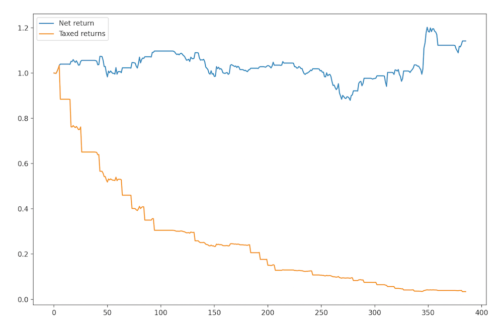
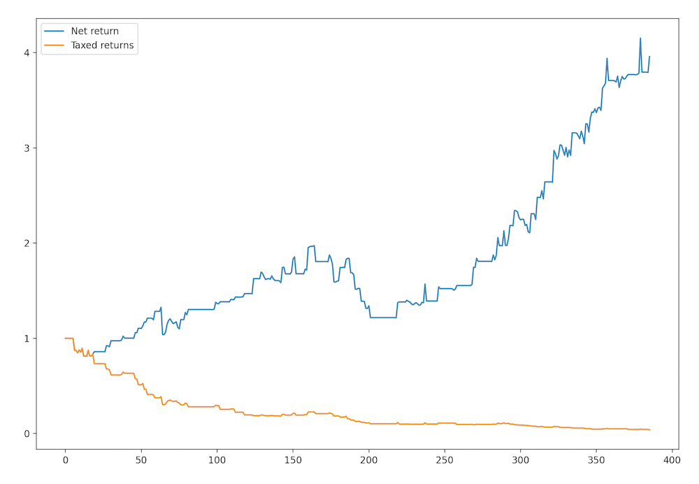

# Pairs Trading

A trading bot to backtest and paper-trade any pairs trading strategy.

## Cointegration

Two time series can be tested for cointegration using the Engle-Granger or similar tests. If $x_t$ and $y_t$ are cointegrated, then a linear combination of them is stationary for some $\beta$ and $u_t$. In other words,

$$y_t - \beta x_t = u_t $$

where $u_t$ is stationary.

## Trading Bot

The Trader class models the logarithmic prices of two assets as such:

$$\log(y_t) = \alpha + \beta \log(x_t) + \epsilon_t$$

where $\epsilon_t$ is a stationary process with mean zero. The spread $\log(y_t) - \beta \log(x_t)$ oscillates around some equilibrum. The Trader class goes long one unit of $y_t$ and short $\beta$ units of $x_t$ when the spread is below some threshold. Conversely, Trader goes long  $\beta$ units of $x_t$ and short one unit of $y_t$ and shortwhen the spread is above some threshold. $\beta$ is estimated via OLS.

## Backtests

Below are two backtests on daily prices at 9:00AM from Jan 1, 2023 - Feb 13, 2024. 

Bitcoin and Etherem:

Two meme coins:

